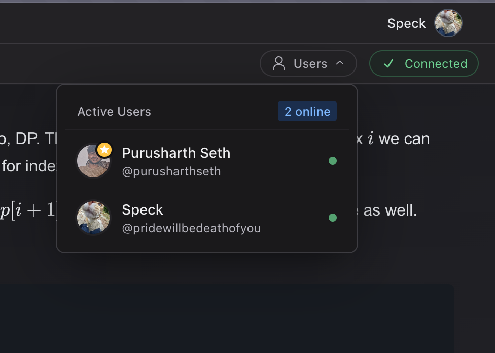

# Scibre

Scribe is a collaborative, real-time Markdown-based note-taking app with a directory-based vault system, multi-cursor awareness, and CRDT-backed syncing.

---

## Features

- **Live collaboration** (CRDT / Yjs) — conflict‑free merges across clients
- **Directory-based vault system** — organize notes in nested folders for better workflow
- **Cursor awareness** — named cursors and selections per user
- **Leader-based server architecture** — server is the leader which handles, reducing DB load
- **Vaults & sharing** — owner / edit / view modes enforced server‑side
- **Split / Editor / Preview** views with draggable divider
- **Markdown preview** with task‑list checkbox toggles (preview updates the doc)
- **Leader-based persistence** — server acts as the leader, batching & debouncing saves to DB (via Drizzle) to reduce load  
- **Clerk** authentication & token‑guarded WebSocket connection
- **Per‑user undo/redo** — powered by `Y.UndoManager`
  
___
## Tech Stack

**Client**
- React+Vite
- CodeMirror 6 (y-codemirror.next, custom theme)
- Yjs
- Clerk (front‑end auth)
- Socket.IO (transport for y‑socket.io)
- Tailwind/Radix UI (layout & widgets)
- markdown-it
- Zustand

**Server**
- Node.js+Express
- Socket.IO
- y-socket.io 
- Clerk
- Drizzle (ORM)
- PostgreSQL
___

## ScreenShots

#### Example collab file view

#### Example Vault view

#### Active Users  view
